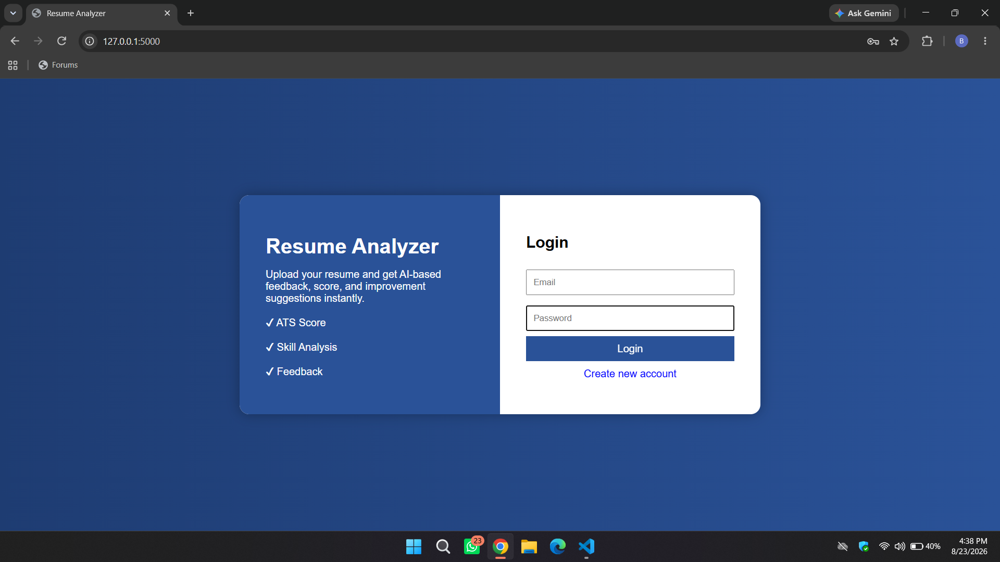
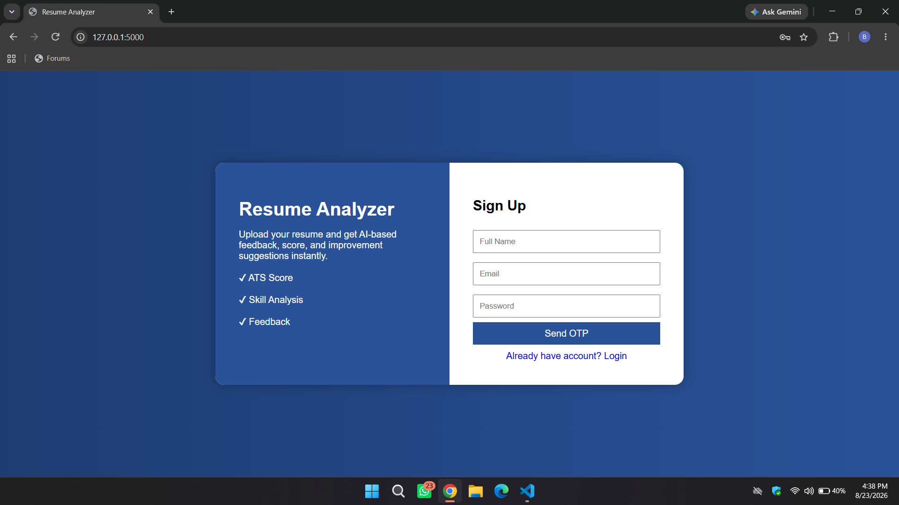
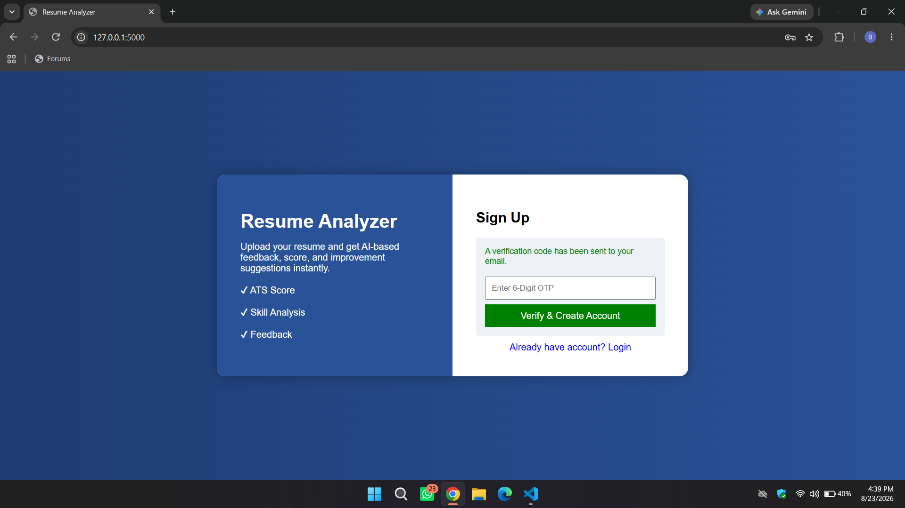
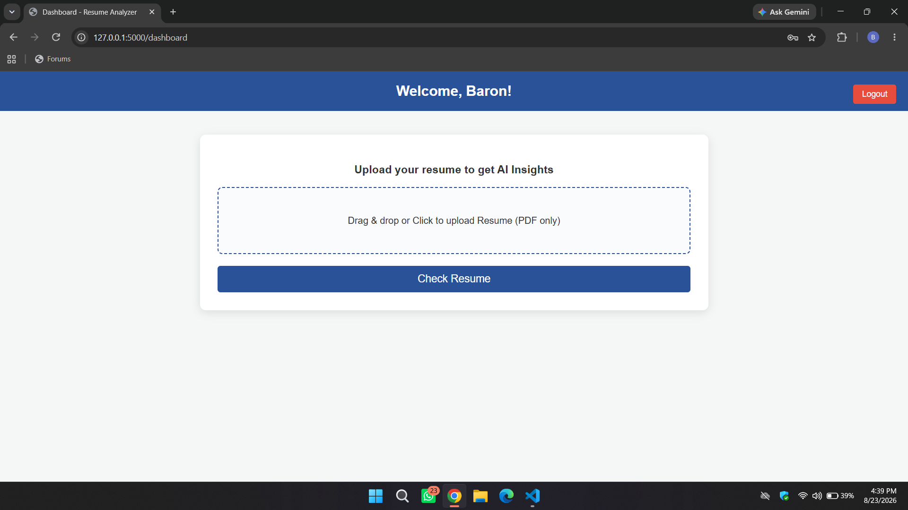

Resume Analyzer

An AI-powered web application that analyzes resumes and provides **ATS score, strengths, feedback, and improvement suggestions** using Google's Gemini AI.

The application allows users to create an account with **email OTP verification**, log in securely, upload their resume in PDF format, and receive AI-generated insights about their resume.

---

 🚀 Features

* 🔐 User Registration & Login
* 📧 Email OTP Verification
* 🔑 Session-based Authentication
* 📄 PDF Resume Upload
* 🤖 AI-powered Resume Analysis using Google Gemini
* 📊 ATS Score out of 100
* 💡 Resume Feedback
* 💪 Strength Identification
* 🛠️ Improvement Suggestions
* 🗄️ SQLite Database for User Management
* 🚪 Logout Functionality
* 📱 Simple and User-Friendly Interface


 🖥️ How It Works

The application follows a simple workflow:

User
 │
 ▼
Create Account
 │
 ▼
Email OTP Verification
 │
 ▼
Login
 │
 ▼
Dashboard
 │
 ▼
Upload Resume (PDF)
 │
 ▼
Extract Resume Text
 │
 ▼
Gemini AI Analysis
 │
 ▼
ATS Score + Feedback + Suggestions


 🛠️ Technologies Used

 Backend

* Python
* Flask
* SQLite

## Frontend

* HTML
* CSS
* JavaScript

### AI & Resume Processing

* Google Gemini API
* `google-generativeai`
* `pypdf`

### Email Verification

* SMTP
* Brevo SMTP Relay

### Environment Management

* `python-dotenv`

---

## 📂 Project Structure

```text
Resume-Analyzer/
│
├── app.py
├── requirements.txt
├── .env
├── users.db
│
├── templates/
│   ├── landing.html
│   └── dashboard.html
│
└── README.md
```

> `users.db` is automatically created when the application starts.

---

## ⚙️ Installation

### 1. Clone the Repository

```bash
git clone https://github.com/Baron05474/Resume-Analyzer.git
```

### 2. Navigate to the Project Directory

```bash
cd Resume-Analyzer
```

### 3. Create a Virtual Environment

```bash
python -m venv venv
```

Activate the virtual environment:

**Windows:**

```bash
venv\Scripts\activate
```

**macOS/Linux:**

```bash
source venv/bin/activate
```

---

## 📦 Install Dependencies

Install all required Python packages:

```bash
pip install -r requirements.txt
```

---

## 🔑 Environment Variables

Create a `.env` file in the root directory of the project.

```env
GEMINI_API_KEY=your_gemini_api_key
PROVIDER_PASSWORD=brevo_smtp_password
```

### Environment Variables Used

| Variable            | Purpose                           |
| ------------------- | --------------------------------- |
| `GEMINI_API_KEY`    | Used to access Google's Gemini AI |
| `PROVIDER_PASSWORD` | Used for SMTP authentication      |


 `.gitignore`:

```gitignore
.env
venv/
__pycache__/
users.db
```

---

## ▶️ Running the Application

Start the Flask application with:

```bash
python app.py
```

The application will run locally on:

```text
http://127.0.0.1:5000
```

Open the URL in your browser to access the application.

---

## 🔐 User Authentication

The application provides a basic authentication system.

### Sign Up

Users provide:

* Full Name
* Email
* Password

After registration, the application generates a **4-digit OTP** and attempts to send it to the user's email.

### OTP Verification

The user enters the received OTP.

If the OTP is correct, the account is created and stored in the SQLite database.

### Login

Registered users can log in using their email and password.

A Flask session is created after successful login.

---

## 📄 Resume Analysis

After logging in, users are redirected to the dashboard.

The user can:

1. Select a resume.
2. Upload the resume in PDF format.
3. Click **Check Resume**.
4. The application extracts text from the PDF.
5. The extracted text is sent to Gemini AI.
6. Gemini analyzes the resume.
7. The generated analysis is displayed on the dashboard.

The AI is instructed to provide:

* **ATS Score out of 100**
* Resume feedback
* Strengths
* Areas for improvement

---

## 🤖 AI Analysis

The project uses Google's Gemini model to analyze the extracted resume content.

The application sends a prompt containing the resume text and requests an analysis focused on ATS performance, strengths, and areas for improvement.

This makes the application useful for users who want an initial AI-powered review of their resume before applying for jobs or internships.

---

## 🗄️ Database

The application uses **SQLite** for storing registered users.

The database contains a `users` table with:

| Column     | Description     |
| ---------- | --------------- |
| `id`       | Unique user ID  |
| `name`     | User's name     |
| `email`    | User's email    |
| `password` | User's password |

The database is automatically initialized when the Flask application starts.

---

## 📧 Email OTP System

The project uses SMTP to send account verification OTPs.

The current implementation uses:

```text
SMTP Server: smtp-relay.brevo.com
SMTP Port: 587
```

SMTP credentials are loaded through environment variables rather than being directly stored in the source code.

---

## 🔒 Security Notes

This project is primarily designed as an educational/project application.

For production use, several security improvements should be implemented, including:

* Password hashing instead of storing plain-text passwords
* Stronger Flask secret key management
* OTP expiration
* OTP attempt limits
* Secure session configuration
* Input validation
* File size restrictions
* More robust error handling
* CSRF protection
* Production-grade database configuration

---

## 🔮 Future Improvements

Possible future improvements include:

* 📊 More detailed ATS analysis
* 🎯 Job-description matching
* 🔍 Keyword extraction
* 🧠 Skill gap analysis
* 📈 Resume score breakdown
* 📑 Resume formatting suggestions
* 💼 Job recommendation based on resume
* 📤 Improved resume report generation
* 🔐 Password hashing and stronger authentication
* ☁️ Cloud database integration
* 📱 Fully responsive mobile UI
* 📊 User analysis history
* 📥 Downloadable AI analysis reports

---

## Screenshots

### 1. Login Page


### 2. Sign Up Page


### 3. OTP Verification Page


### 4. Dashboard


### Resume Analysis

Add your analysis result screenshot here:

```markdown

```

---

## 🎯 Project Purpose

The main goal of this project is to build a simple and practical **AI-powered Resume Analyzer** that helps students and job seekers understand the strengths and weaknesses of their resumes.

It also demonstrates the integration of:

* Web development
* Backend development
* Database management
* PDF processing
* Email verification
* REST-style API routes
* Generative AI

into a single full-stack application.

---

## 👨‍💻 Author

**Baron Bhowmick**

B.Tech in Computer Science & Engineering


